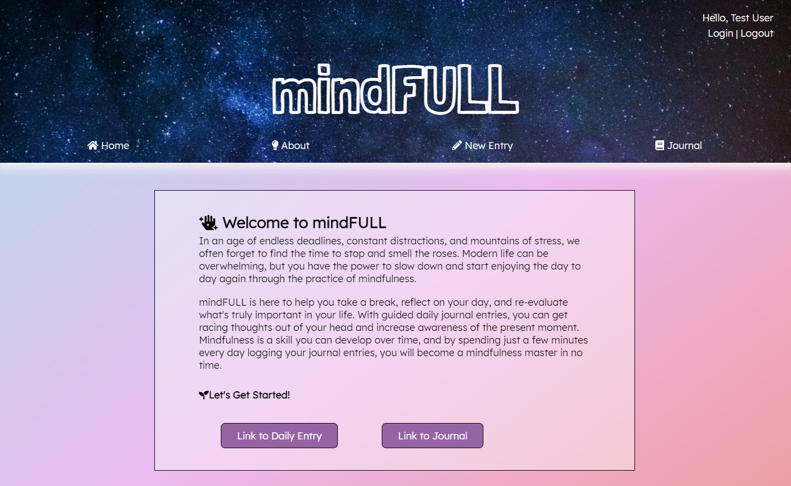
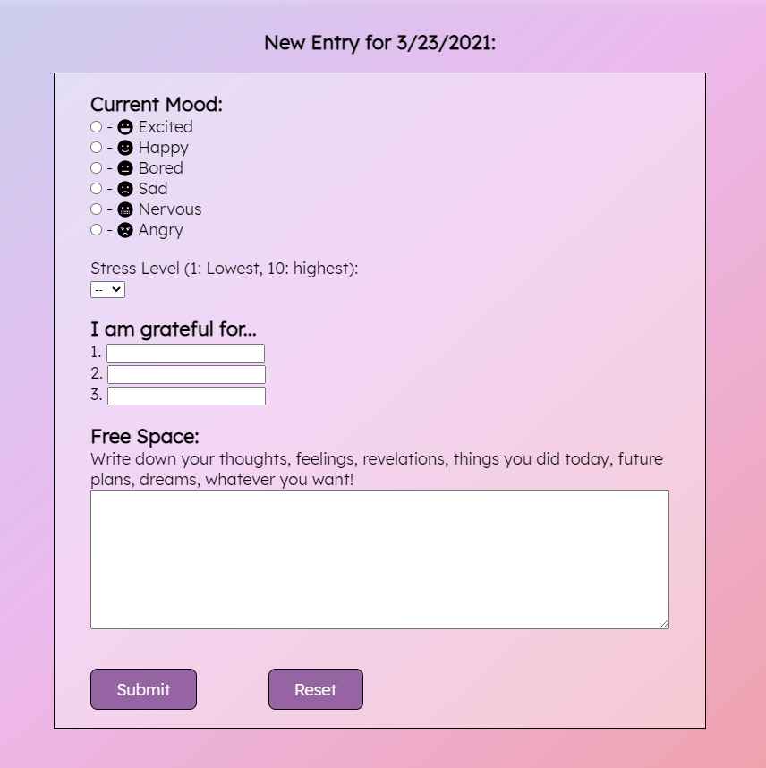
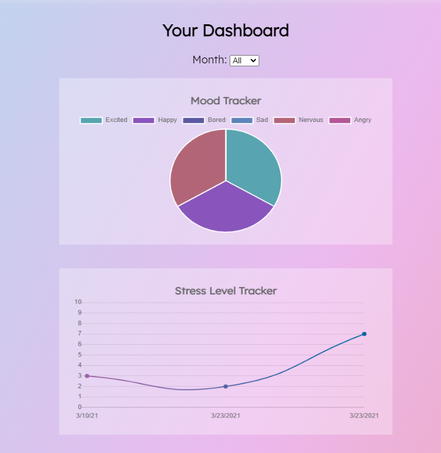
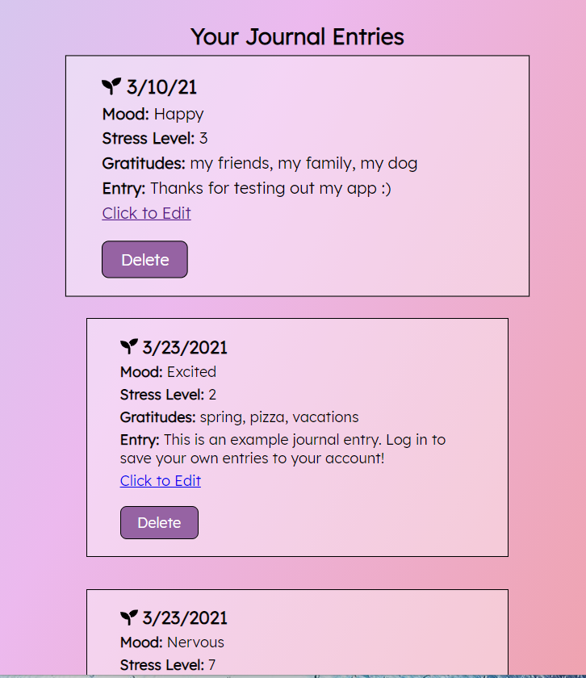
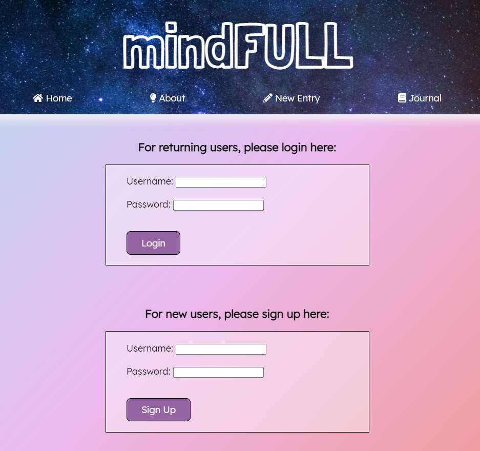
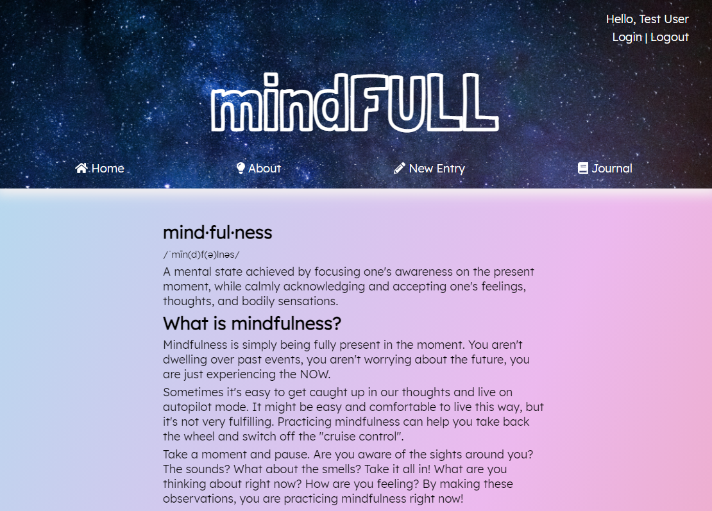

# mindFULL App

### Description: 
Start to gain control of your mind and de-stress with mindFULL: a virtual mindfulness journal. Now you don't have to worry about carrying a notebook around with you everywhere you go. With mindFULL, you will always have access to your journal entries on mobile or desktop. 

Users will have a guided journal entry to fill out each day, which will include mood and stress level trackers, a gratitude section, and a free form for any other daily notes. The entries are saved to the user's journal log (if an account is made), which the user can access anytime. Progress trackers will show how a user is doing on their stress levels and overall moods on their journal page. 

### Link to mindFULL Live App: [https://mindfull-app.vercel.app/](https://mindfull-app.vercel.app/)
### Link to mindFULL API Repository: [https://github.com/kaitlynyancey/mindfull-api](https://github.com/kaitlynyancey/mindfull-api)
- Documentation of the API endpoints can be found in the README file in the mindFULL API repository. 
___
## Screenshots:

### Home Page

This is the landing page of the app. From here you can access your daily entry or your journal log. Also, on any page of the app, you can use the navigation links to visit the home page, about section, entry page, or journal log. You can also login or logout with the links in the top right corner of the page 

___
### Entry Page

This is the daily entry form. You will be prompted to enter your current mood, stress level, three daily gratitudes, and any notes or thoughts you want to record

___
### Journal Log

The completed entries will be available to access in the journal log. You can keep track of your progress with the stress level and mood trackers

___
### Login Page

You can create a new account or login to your current account in the login page

___
### About Page

For more information on mindfulness, you can visit the about page

___
### Technology Used
* HTML 
* CSS
* JavaScript
* React
* Node 
* PostGreSQL
* Express
